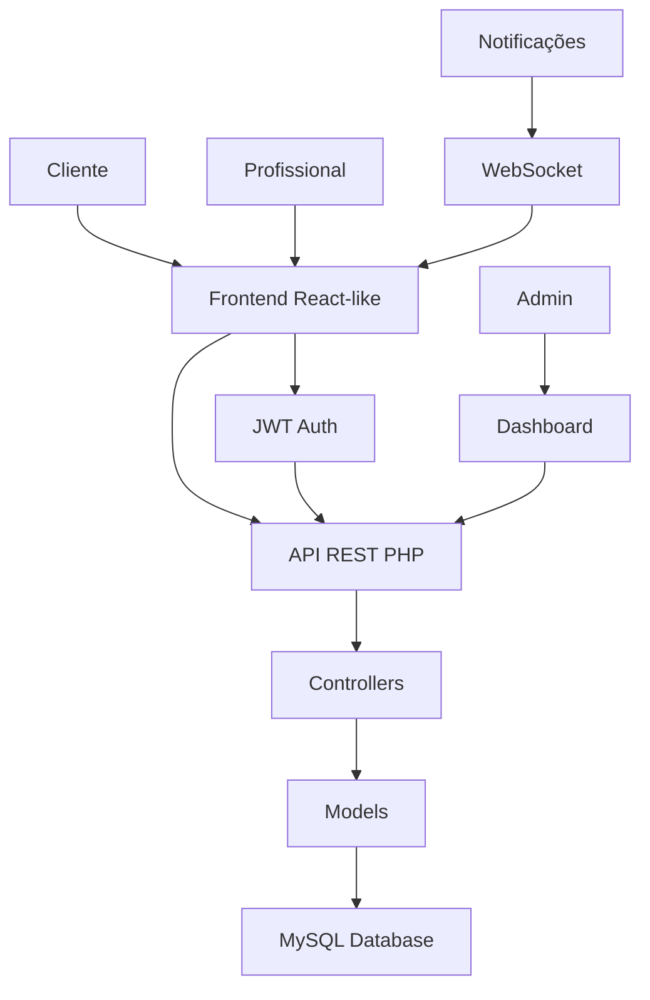

<div align="center">

  <h2>✨ GLOWUP ✨</h2>
  
  <p align="center">
    <a href="https://git.io/typing-svg"></a>
  </p>
</div>

<div# 💄 GlowUp - Plataforma de Beleza e Estética

<div align="center">


[](LICENSE)
[](CHANGELOG.md)

**Uma plataforma completa para gestão de salões de beleza, conectando profissionais e clientes através de agendamentos inteligentes e experiência premium.**

[🌐 Live Demo](https://glowup-demo.com) • [📖 Documentação](docs/) • [🚀 Getting Started](#-getting-started) • [📱 Screenshots](#-screenshots)

---

## 📋 Índice

- [📖 Sobre o Projeto](#-sobre-o-projeto)
- [✨ Funcionalidades](#-funcionalidades)
- [🏗️ Arquitetura](#️-arquitetura)
- [🛠️ Tecnologias](#️-tecnologias)
- [🚀 Getting Started](#-getting-started)
- [📱 Instalação](#-instalação)
- [🔧 Configuração](#-configuração)
- [📊 API Endpoints](#-api-endpoints)
- [🎨 Frontend Components](#-frontend-components)
- [📱 Responsividade](#-responsividade)
- [🔐 Segurança](#-segurança)
- [📈 Performance](#-performance)
- [🤝 Contribuição](#-contribuição)
- [📄 Licença](#-licença)

---

## 📖 Sobre o Projeto

O **GlowUp** é uma plataforma SaaS completa desenvolvida para modernizar a gestão de salões de beleza. Com uma interface intuitiva e recursos avançados, permite que profissionais de estética gerenciem seus negócios de forma eficiente enquanto oferecem uma experiência excepcional aos clientes.

### 🎯 Objetivo Principal

Transformar a gestão de negócios de beleza através de tecnologia inovadora, automatizando processos administrativos e proporcionando uma experiência digital moderna tanto para profissionais quanto para clientes.

### 💡 Problema Resolvido

- **Gestão Manual** substituída por automação inteligente
- **Agendamentos Confusos** resolvidos com sistema intuitivo
- **Comunicação Ineficiente** melhorada com notificações em tempo real
- **Visibilidade Limitada** expandida com marketplace integrado

---

## ✨ Funcionalidades

### 🏢 Para Profissionais

| Funcionalidade | Descrição | Status |
|---------------|-----------|--------|
| 📅 **Agendamento Inteligente** | Sistema completo com gestão de horários e disponibilidade | ✅ Completo |
| 👥 **Gestão de Clientes** | Cadastro, histórico e preferências dos clientes | ✅ Completo |
| 🏪 **Marketplace** | Exposição de serviços para novos clientes | ✅ Completo |
| ⭐ **Avaliações** | Sistema de feedback e reputação | ✅ Completo |
| 📱 **Perfil Profissional** | Gestão completa de perfil e serviços | ✅ Completo |
| 📍 **Gestão de Endereço** | Localização do estabelecimento | ✅ Completo |

### 👤 Para Clientes

| Funcionalidade | Descrição | Status |
|---------------|-----------|--------|
| 🔍 **Descoberta** | Encontre profissionais e serviços próximos | ✅ Completo |
| 📅 **Agendamento Online** | Reserve horários de forma rápida e intuitiva | ✅ Completo |
| ⭐ **Avaliações** | Deixe feedback e veja reputação | ✅ Completo |
| 🔔 **Notificações** | Lembretes e atualizações | ✅ Completo |
| 📱 **Experiência Mobile** | Interface otimizada para smartphones | ✅ Completo |
| 📋 **Cadastro Simplificado** | Registro rápido e fácil | ✅ Completo |

---

## 🏗️ Arquitetura

### 📁 Estrutura do Projeto

```
GlowUp/
├── 📁 config/                 # Configurações do sistema
│   ├── database.php          # Conexão com banco de dados
│   └── config.php            # Variáveis de ambiente
├── 📁 controllers/           # Lógica de negócio PHP
│   ├── AuthController.php    # Autenticação e usuários
│   ├── AgendamentoController.php # Gestão de agendamentos
│   └── ProfissionalController.php # Gestão de profissionais
├── 📁 models/                # Models e entidades
│   ├── UsuarioModel.php      # Modelo de usuário
│   ├── AgendamentoModel.php # Modelo de agendamento
│   └── ServicoModel.php     # Modelo de serviços
├── 📁 routes/                # API Routes
│   ├── login.php            # Endpoint de autenticação
│   ├── agendamento.php      # Gestão de agendamentos
│   └── profissional.php    # Gestão de profissionais
├── 📁 helpers/               # Utilitários e helpers
│   ├── token_jwt.php        # Gestão de tokens JWT
│   ├── response.php         # Respostas padronizadas
│   └── validation.php       # Validação de dados
├── 📁 src/                   # Frontend JavaScript
│   ├── components/          # Componentes reutilizáveis
│   │   ├── NavBar.js        # Navegação principal
│   │   ├── Footer.js        # Rodapé
│   │   ├── Cards.js         # Cards de serviços
│   │   └── Notification.js  # Sistema de notificações
│   ├── pages/               # Páginas da aplicação
│   │   ├── home.js          # Página inicial
│   │   ├── dashboard.js     # Dashboard profissional
│   │   ├── agendamento.js  # Sistema de agendamento
│   │   └── perfil.js        # Gestão de perfil
│   ├── utils/               # Utilitários JavaScript
│   │   ├── AuthState.js     # Estado de autenticação
│   │   ├── api.js           # Cliente HTTP
│   │   └── formValidation.js # Validação de formulários
│   └── css/                 # Estilos e design
│       ├── global.css       # Estilos globais
│       ├── responsivity.css # Sistema responsivo
│       ├── utilities.css    # Classes utilitárias
│       └── components/       # CSS específicos
├── 📁 public/                # Assets públicos
│   ├── index.html           # Template principal
│   ├── assets/              # Imagens e mídias
│   └── uploads/             # Uploads de usuários
├── 📁 bootstrap/             # Framework CSS
├── 📄 glowup.sql            # Banco de dados SQL
├── 📄 index.php             # Entry point principal
└── 📄 .htaccess             # Configurações Apache
```

### 🔄 Fluxo de Dados



---

## 🛠️ Tecnologias

### 🎨 Frontend Stack

| Tecnologia | Versão | Uso | Descrição |
|-----------|--------|-----|-----------|
| **JavaScript** | ES6+ | Lógica principal | JavaScript moderno com modules |
| **CSS3** | Latest | Estilização | CSS Grid, Flexbox, Custom Properties |
| **Bootstrap** | 5.3+ | UI Framework | Componentes e grid system |
| **Font Awesome** | 6.5+ | Ícones | Biblioteca de ícones vetoriais |
| **Google Fonts** | Latest | Tipografia | Inter, Poppins |

### 🔧 Backend Stack

| Tecnologia | Versão | Uso | Descrição |
|-----------|--------|-----|-----------|
| **PHP** | 8.0+ | Backend principal | Lógica de negócio e API |
| **MySQL** | 8.0+ | Banco de dados | Armazenamento persistente |
| **JWT** | Latest | Autenticação | Tokens seguros |
| **REST API** | - | Arquitetura | API RESTful completa |

### 🛡️ Segurança

| Tecnologia | Descrição |
|-----------|-----------|
| **JWT Tokens** | Autenticação stateless segura |
| **Input Validation** | Validação rigorosa de dados |
| **SQL Injection Protection** | Prepared statements |
| **XSS Protection** | Sanitização de output |
| **HTTPS Ready** | Suporte completo a SSL |

---

## 🚀 Getting Started

### 📋 Pré-requisitos

- **PHP** 8.0 ou superior
- **MySQL** 8.0 ou superior  
- **Apache**
- **Composer** (opcional, para gerenciamento de dependências)
- **Node.js** (opcional, para desenvolvimento)

### ⚡ Instalação Rápida

```bash
# 1. Clone o repositório
git clone https://github.com/your-username/glowup.git
cd glowup

# 2. Configure o banco de dados
mysql -u root -p < glowup.sql

# 3. Configure as variáveis de ambiente
cp config/config.example.php config/config.php
# Edite config.php com suas credenciais

# 4. Configure o servidor web
# Apache: Configure DocumentRoot para /public
# Nginx: Configure root para /public e adicione rewrite rules

# 5. Acesse a aplicação
# http://localhost/glowup
```


## 📱 Instalação Detalhada

### 🔧 Configuração do Ambiente

#### 1. Configuração Apache

```apache
# .htaccess
RewriteEngine On
RewriteCond %{REQUEST_FILENAME} !-f
RewriteCond %{REQUEST_FILENAME} !-d
RewriteRule ^(.*)$ index.php [QSA,L]
```


##  Responsividade

### 📊 Responsividade

- **Design responsivo** para dispositivos móveis e desktop
- **Layout adaptável** para diferentes tamanhos de tela
- **Componentes responsivos** para uma experiência consistente

---


## 🤝 Contribuição

### 📋 Como Contribuir

1. **Fork** o repositório
2. **Crie** uma branch para sua feature (`git checkout -b feature/AmazingFeature`)
3. **Commit** suas mudanças (`git commit -m 'Add some AmazingFeature'`)
4. **Push** para a branch (`git push origin feature/AmazingFeature`)
5. **Abra** um Pull Request

### 🎯 Diretrizes de Contribuição

#### 📝 Código
- Siga **PSR-12** para PHP
- Use **ES6+** para JavaScript
- **Comment** código complexo
- **Teste** suas alterações

#### 🎨 Design
- Mantenha **consistência visual**
- Use o **sistema de grid** responsivo
- **Teste** em múltiplos dispositivos
- **Respeite** as guidelines de acessibilidade

#### 📚 Documentação
- Atualize **README** quando necessário
- Documente **novas features**
- Adicione **exemplos** de uso
- Mantenha **changelog** atualizado


## 📄 Licença

Este projeto está licenciado sob a **MIT License** - veja o arquivo [LICENSE](LICENSE) para detalhes.

```
MIT License

Copyright (c) 2024 GlowUp Platform

Permission is hereby granted, free of charge, to any person obtaining a copy
of this software and associated documentation files (the "Software"), to deal
in the Software without restriction, including without limitation the rights
to use, copy, modify, merge, publish, distribute, sublicense, and/or sell
copies of the Software, and to permit persons to whom the Software is
furnished to do so, subject to the following conditions:

The above copyright notice and this permission notice shall be included in all
copies or substantial portions of the Software.
```

---


## 📞 Contato & Suporte

### 🏢 GlowUp Team

- **📧 Email**: [contato@glowup.com](mailto:contato@glowup.com)
- **🌐 Website**: [www.glowup.com](https://www.glowup.com)
- **📱 WhatsApp**: +55 (11) 9999-9999
- **🐦 Twitter**: [@glowup_br](https://twitter.com/glowup_br)
- **📷 Instagram**: [@glowup.brasil](https://instagram.com/glowup.brasil)

### 💬 Comunidade

- **📋 Discord**: [GlowUp Community](https://discord.gg/glowup)
- **💬 Telegram**: [GlowUp Devs](https://t.me/glowup_devs)
- **📱 LinkedIn**: [GlowUp Company](https://linkedin.com/company/glowup)

### 🆘 Suporte Técnico

- **📖 Documentação**: [docs.glowup.com](https://docs.glowup.com)
- **🐛 Bug Reports**: [GitHub Issues](https://github.com/your-username/glowup/issues)
- **💡 Feature Requests**: [GitHub Discussions](https://github.com/your-username/glowup/discussions)

---

<div align="center">

**⭐ Se este projeto ajudou você, considere dar uma estrela! ⭐**

Made with ❤️ by [GlowUp Team](https://github.com/your-username)

[🔝 Top](#-glowup---plataforma-de-beleza-e-estética) • [📖 Docs](docs/) • [🚀 Getting Started](#-getting-started)

</div>
